# Thor Dual Screen

A free SMAPI mod that turns the AYN Thor's second screen into a touch companion for Stardew Valley
running in [Cinderbox](https://github.com/Ekyso/Cinderbox). No companion app, no subscription, no unlock code.

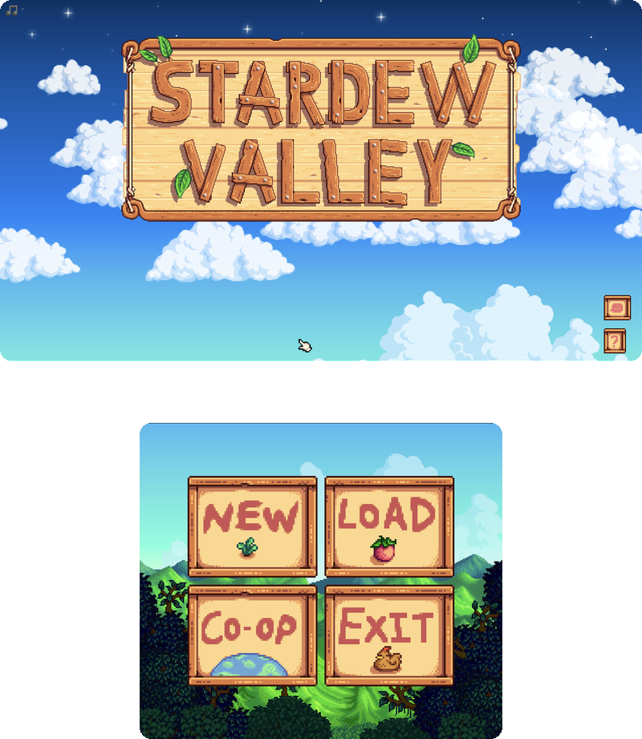

## Why this exists

A few dual-screen projects for handhelds have appeared recently that put basic features behind a
paywall or ship closed builds, often quickly assembled and hard to inspect. I think a mod that
runs inside your game, next to your save files, should be something you can read before you trust
it.

So this one is, and always will be:

- **Free.** No paid tier, no Patreon-only build, no feature held back.
- **Open source, under the GPL-3.0.** Every line that runs on your device is in this repository.
  Read it, build it yourself, or point someone you trust at it. The GPL also means any fork,
  including a paid one, has to stay open too.
- **Honest about how it was made.** This mod was written with heavy help from an AI coding
  assistant (Claude), directed, tested and reviewed on real hardware by me. I'd rather say so up
  front than leave you to guess.

## What it adds

The rule for every feature: **add something the game doesn't already give you, or make something
the controller makes awkward easy.** The bottom screen is not a second copy of the top one. It
doesn't mirror the map, repeat the HUD, or reveal anything the game hides from you.

### Today

What you'd otherwise check the TV, the calendar and the field for each morning: luck, tomorrow's
weather, crops ready and dry, the traveling cart and festivals, and this week's birthdays.

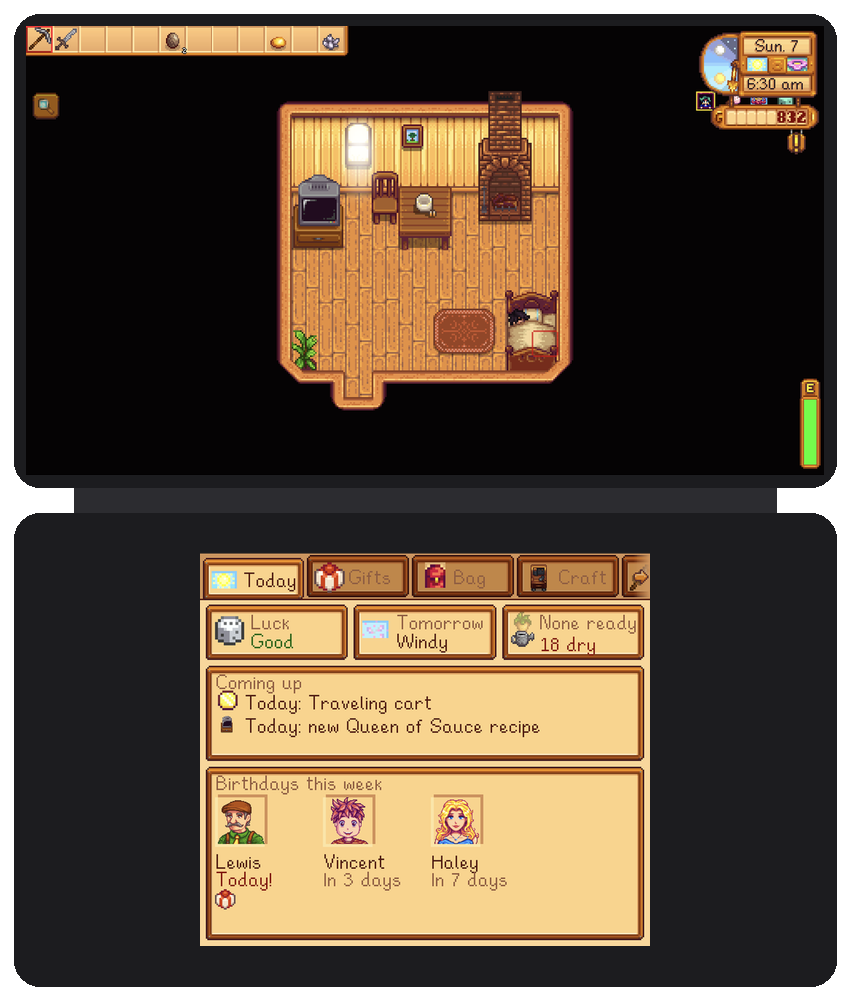

### Gifts

Hold an item to see who loves and likes it, and which bundle needs it. Walk up to a villager to see
their hearts, this week's gifts and what they love. No more wiki tab open beside the game.

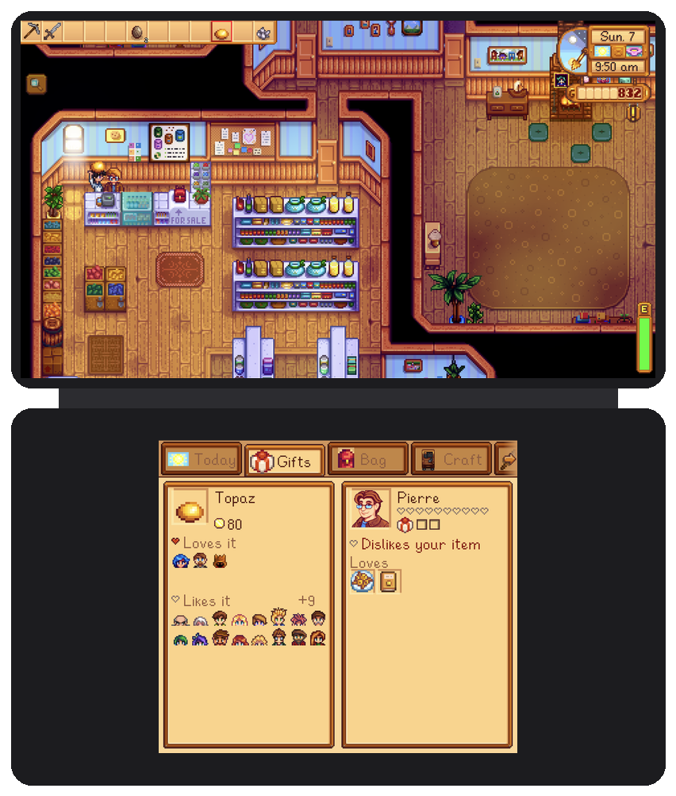

### Bag

Touch inventory. Tap to hold, drag to rearrange, drag onto the trash can (with your trash-can
upgrade refund), and stack your bag into nearby chests in one tap. Picking items off a 36-slot grid
with a d-pad was the single worst part of playing on a handheld.

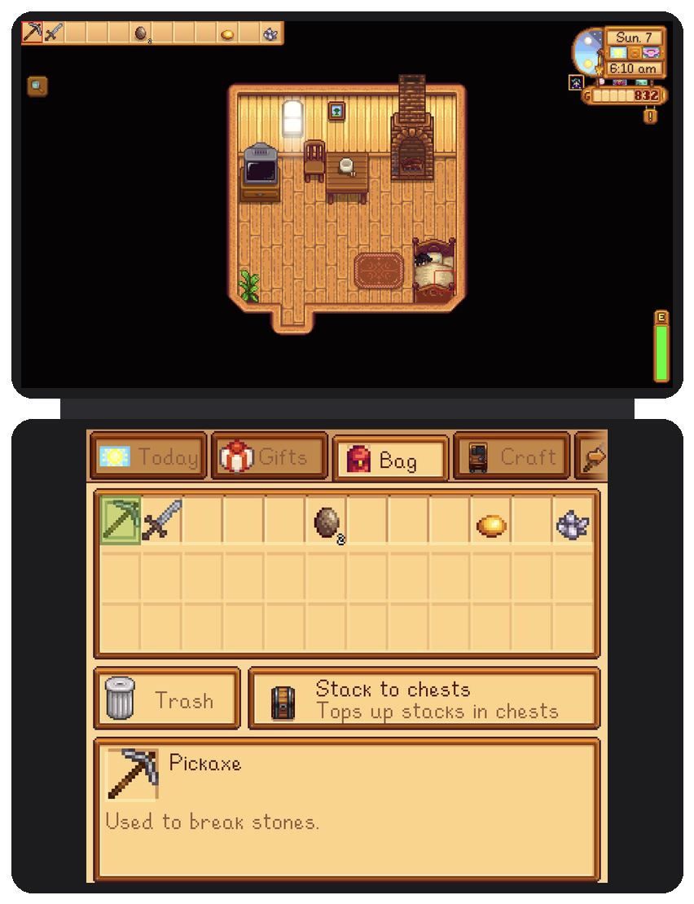

### Craft

Every recipe you know, scrollable, with what you have against what it needs. Tap Craft and it goes
straight into your bag.

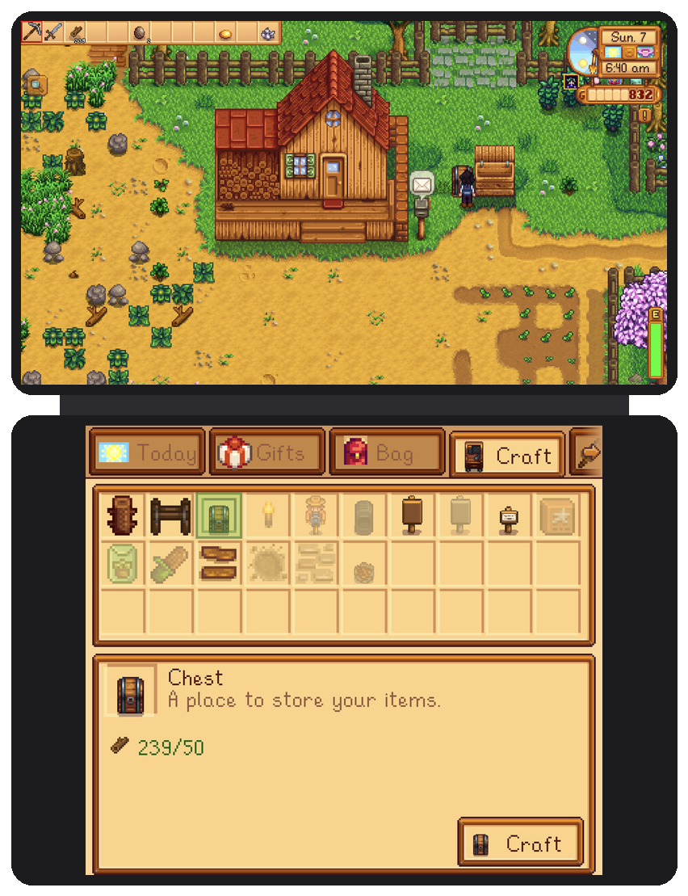

### Aim

A close-up of the tiles around you. Tap a tile to place furniture, seeds or a chest exactly there,
or to turn and swing your tool at it. A green or red square shows whether it fits, and your hotbar
sits along the bottom so you can swap tools without leaving.

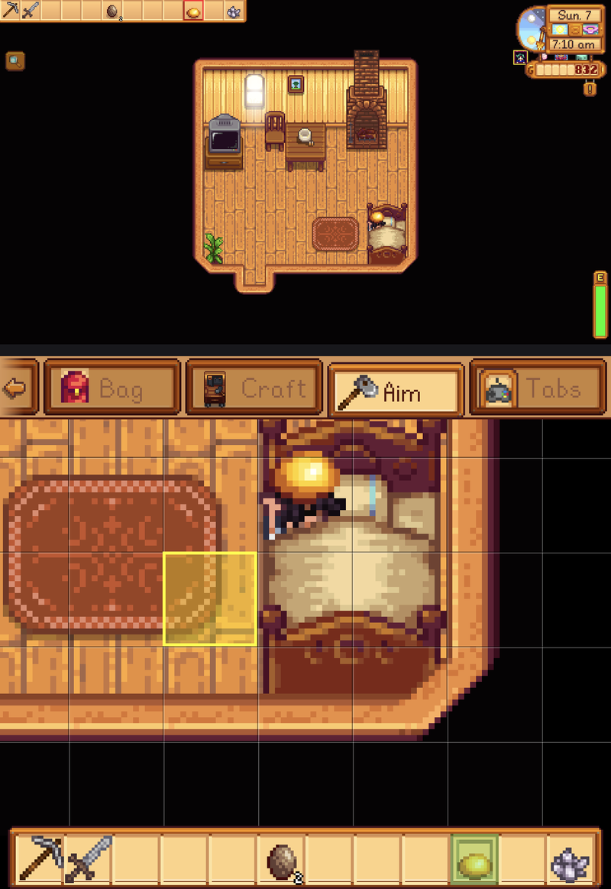

### When a menu opens on top

The bottom screen adapts to whatever the game is asking you to do:

| Chest | Shop | Shipping bin | Clint's geodes |
|---|---|---|---|
| 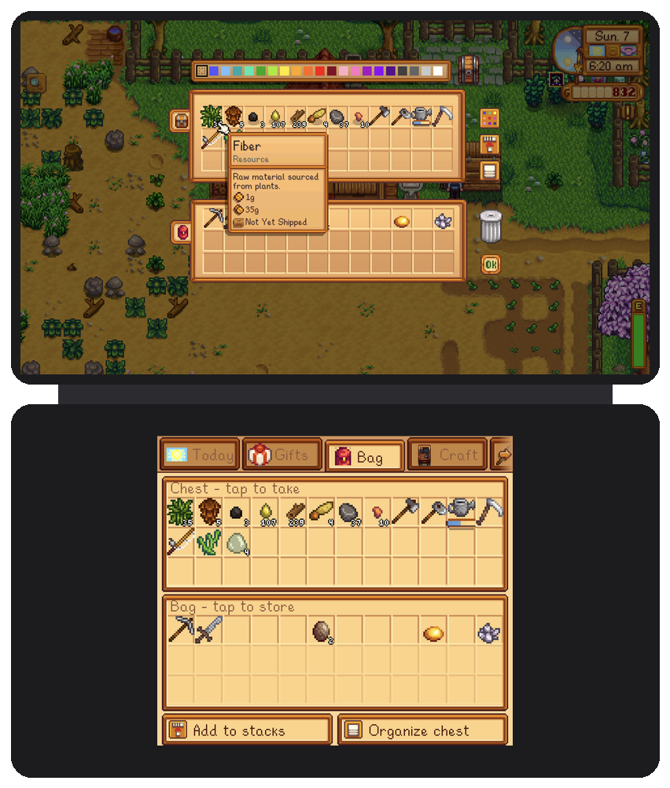 | 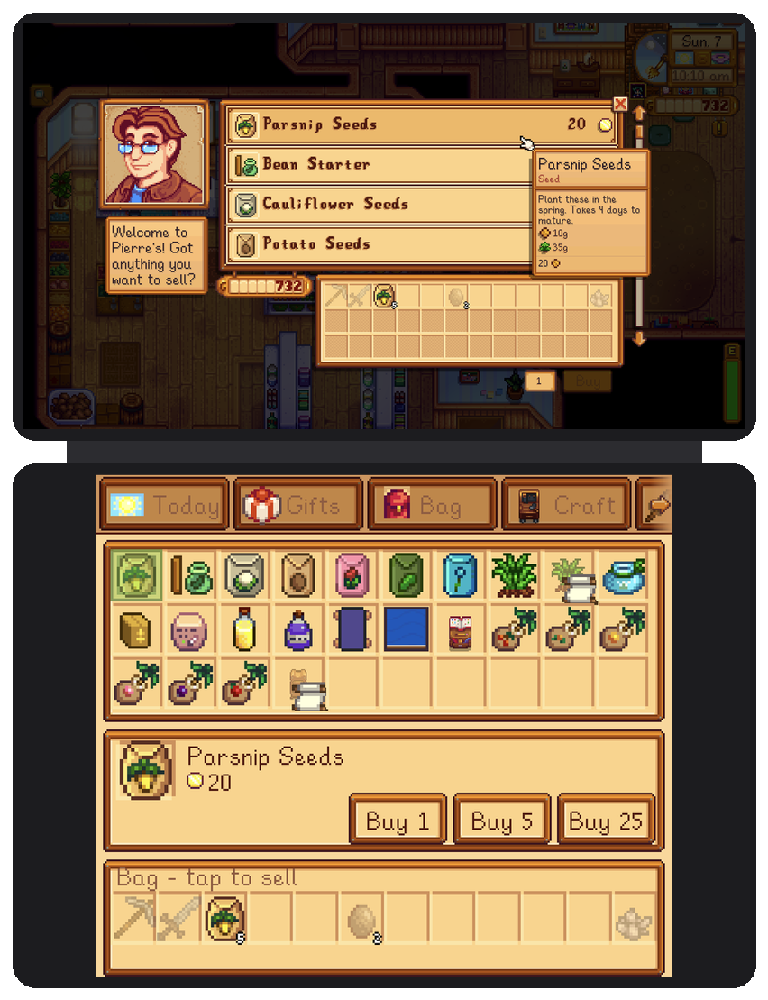 | 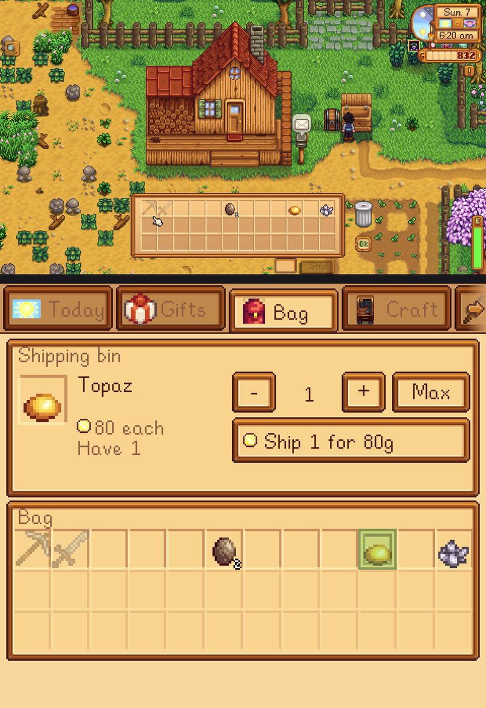 | 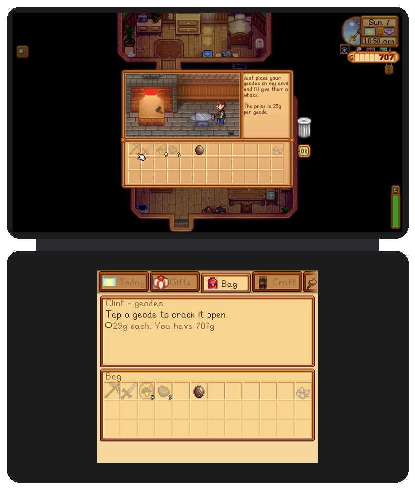 |
| Tap to take or store; fill stacks and organize | Buy 1/5/25; pick an amount to sell | Pick an amount to ship | Tap a geode to crack it |

Questions with answers (the mine elevator, villagers asking you something) appear as big buttons.
Everything here goes through the game's own menus, so prices, rules and sounds are exactly the
game's.

### Title screen and tabs

The top screen keeps just the title art; New, Load, Co-op and Exit live on the bottom, along with
your save list. A Tabs page lets you hide and reorder tabs, and the mod remembers the one you used
last.

| Load | Tabs |
|---|---|
| 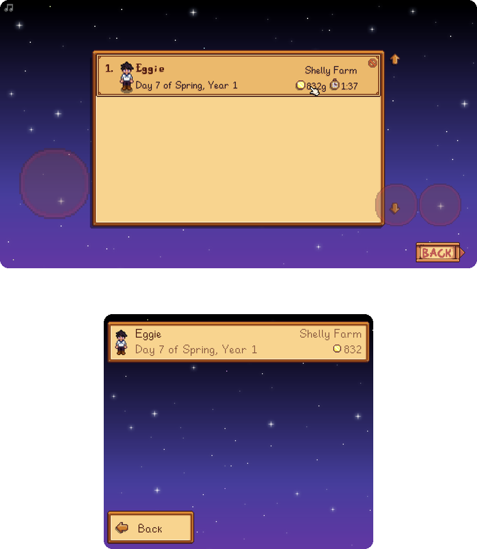 | 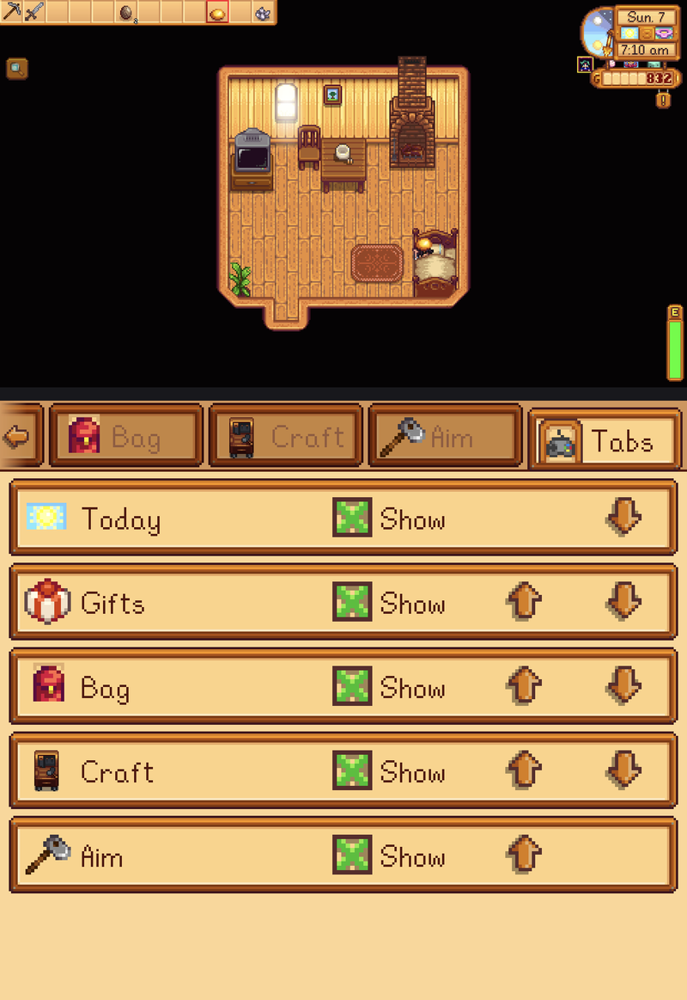 |

## What it deliberately doesn't do

- **No duplicates.** No minimap that just repeats the top screen, no second copy of the clock or
  money.
- **No cheats.** It shows what the game would tell you anyway (the TV, the calendar, a villager's
  reaction), not hidden numbers.
- **No keep-awake.** The panel hides when the Thor sleeps and never holds the screen on.
- **Your controller stays in charge.** The bottom window never takes button focus, and touching it
  doesn't switch the game into mouse mode.

## Requirements

- AYN Thor (the bottom screen is the Android "presentation" display).
- [Cinderbox](https://github.com/Ekyso/Cinderbox) with its SMAPI, and your own copy of Stardew Valley.

## Install

1. Download `ThorDualScreen` from the [releases page](../../releases), or build it (below).
2. Copy the folder to `/sdcard/StardewValley/desktop/Mods/ThorDualScreen/`.
3. Start the game from Cinderbox. The bottom screen lights up on the title screen.

Back up `/sdcard/StardewValley/desktop/Saves` before trying any new mod.

## How it works

Cinderbox runs SMAPI inside the same Android process as the game, so a mod can reach Android
directly. This one opens a `Presentation` window on the second display, draws each panel offscreen
with the game's own `SpriteBatch`, textures and fonts, and copies the pixels into that window a few
times a second (30 on Aim). Touches are read on the Android side and replayed on the game thread as
clicks on the game's own menus, so the game decides what every tap does.

## Build

`refs/` holds the assemblies the mod compiles against. They're the game's and Cinderbox's, so they
aren't in this repo; pull them from your own device:

- `Stardew Valley.dll`, `StardewValley.GameData.dll`, `xTile.dll` from `/sdcard/StardewValley/desktop/GameFiles`
- `StardewModdingAPI.dll` from `/sdcard/StardewValley/smapi-internal`
- `Mono.Android.dll`, `Java.Interop.dll`, `MonoGame.Framework.dll` unpacked from Cinderbox's
  `lib/arm64-v8a/libassembly-store.so` (LZ4 blocks with an `XALZ` header)

```sh
cd mod && dotnet build -c Release
adb push mod/bin/Release/net10.0/DualScreen.dll mod/manifest.json /sdcard/StardewValley/desktop/Mods/ThorDualScreen/
```

## Credits

This mod stands on other people's work. Thank you to:

**What it runs on**
- **[ConcernedApe](https://www.stardewvalley.net/)** for Stardew Valley. Every sprite on the bottom
  screen is drawn live from your own copy of the game; none of the game's art or code is in this
  repository.
- **[Ekyso](https://github.com/Ekyso)** for [Cinderbox](https://github.com/Ekyso/Cinderbox) and
  [SMAPI for Cinderbox](https://github.com/Ekyso/SMAPI-For-Cinderbox), which make desktop Stardew
  and its mods run on Android in the first place.
- **[Pathoschild](https://github.com/Pathoschild)** and the SMAPI contributors for
  [SMAPI](https://smapi.io), the modding API everything here plugs into.
- The **[MonoGame](https://monogame.net/)** team, and Microsoft's
  **[.NET for Android](https://github.com/dotnet/android)**, whose Android bindings let a game mod
  open a window on a second screen.
- **[AYN](https://www.ayntec.com/)** for the Thor and its second screen.

**What showed the way**
- The Nintendo DS and 3DS games that worked out what a second screen is for, especially
  *Animal Crossing: New Leaf* and *Story of Seasons*: touch items, quick reference, nothing you
  have to watch during action.

**What it was built with**
- [ILSpy](https://github.com/icsharpcode/ILSpy) by the ICSharpCode team, for reading how the game's
  own menus work so the mod can call them instead of reimplementing them.
- [Claude](https://claude.com/claude-code) by Anthropic, as a coding assistant.

## Licence

[GPL-3.0](LICENSE). Stardew Valley and its assets belong to ConcernedApe; this licence covers only
the code in this repository.
