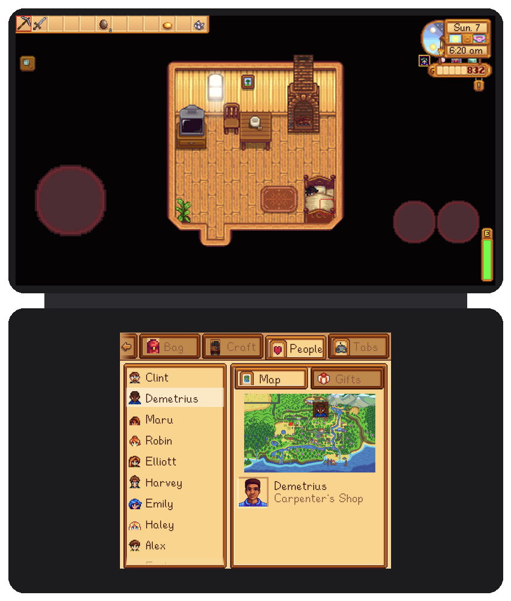
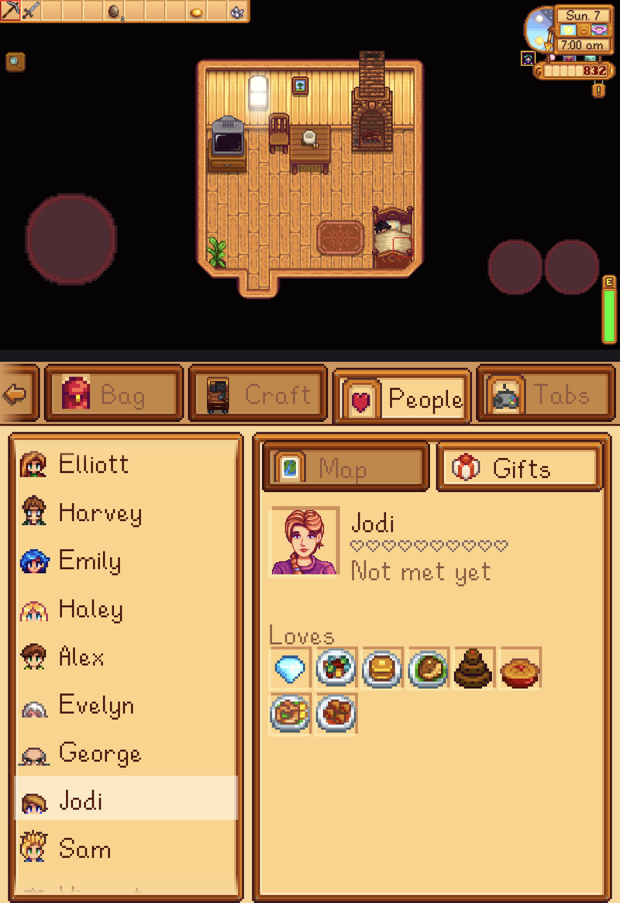
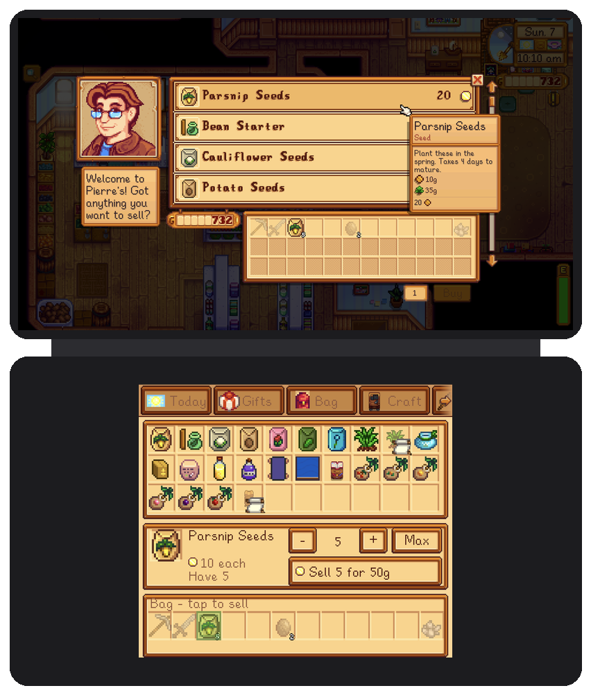

# Features

Everything the bottom screen does, tab by tab. Back to the [README](../README.md).

> [!TIP]
> **It adds, it never duplicates.** Every feature either gives you something the game doesn't, or
> makes something the controller makes awkward easy. The bottom screen is not a second copy of the
> top one: it doesn't mirror the map, repeat the HUD, or reveal anything the game hides from you.

## Today

What you'd otherwise check the TV, the calendar and the field for each morning: luck, tomorrow's
weather, crops ready and dry, the traveling cart and festivals, and this week's birthdays.

## Gifts

Hold an item to see who loves and likes it, and which bundle needs it. Walk up to a villager to see
their hearts, this week's gifts and what they love. No more wiki tab open beside the game.

## People

Everyone you've met (nobody you haven't, so no spoilers), with whoever is in your area first in
green and a gift box on today's birthday. Tap a name, then switch between **Map**, the game's own
world map with them pinned and you marked, and **Gifts**: their hearts, this week's gifts, how they'd
take what you're holding, and what they love.

## Bag

Touch inventory. Tap to hold, drag to rearrange, drag onto the trash can (with your trash-can
upgrade refund), and stack your bag into nearby chests in one tap. Picking items off a 36-slot grid
with a d-pad was the single worst part of playing on a handheld.

## Craft

Every recipe you know, scrollable, with what you have against what it needs. Tap Craft and it goes
straight into your bag.

## Aim

A close-up of the tiles around you. Tap a tile to place furniture, seeds or a chest exactly there,
or to turn and swing your tool at it. A green or red square shows whether it fits, and your hotbar
sits along the bottom so you can swap tools without leaving. It follows the game's lighting, so
nights, caves and lamps look the same as on top.

## When a menu opens on top

The bottom screen adapts to whatever the game is asking you to do:

| Chest | Shop | Shipping bin | Clint's geodes |
|---|---|---|---|
|  |  |  |  |
| Tap to take or store; fill stacks and organize | Buy 1/5/25; pick an amount to sell | Pick an amount to ship | Tap a geode to crack it |

Selling at a shop: tap a bag item, choose how many, then Sell. Tap the amount itself to type a
number on a pad. In a chest, hold a slot to move part of a stack.

Also covered: **Community Center bundles** (pick a bundle, then tap items to give them; ones it
can't use are greyed out), **the museum, forge and sewing machine** (items the menu won't take are
greyed out), and **end of day** (the shipping summary by category, level-up and profession choices,
and saving). While a menu takes over, the tab strip hides.

Questions with answers (the mine elevator, villagers asking you something) appear as big buttons.
Everything here goes through the game's own menus, so prices, rules and sounds are exactly the
game's.

## Title screen and tabs

The top screen keeps just the title art; New, Load, Co-op and Exit live on the bottom, along with
your save list, and the background follows the game's camera into the night sky when Load opens.
Loading uses the game's own scroll strip. Exit fully closes the app (Cinderbox otherwise leaves it,
and its music, running). A Tabs page lets you hide and reorder tabs, and the mod remembers the one
you used last.

| Load | Tabs |
|---|---|
|  |  |
